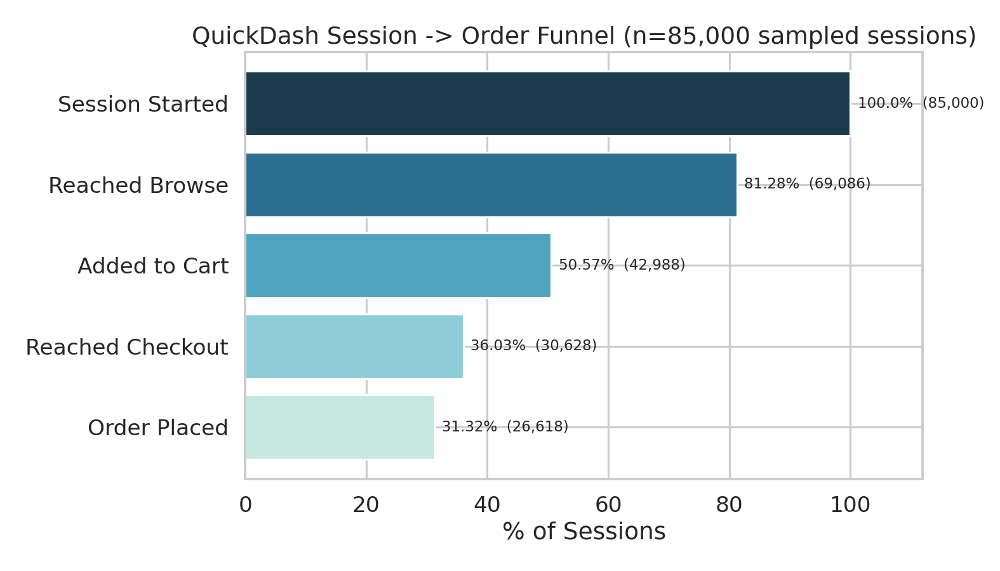
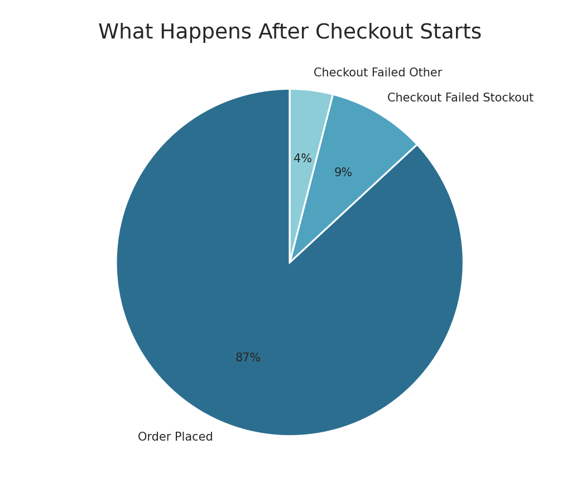
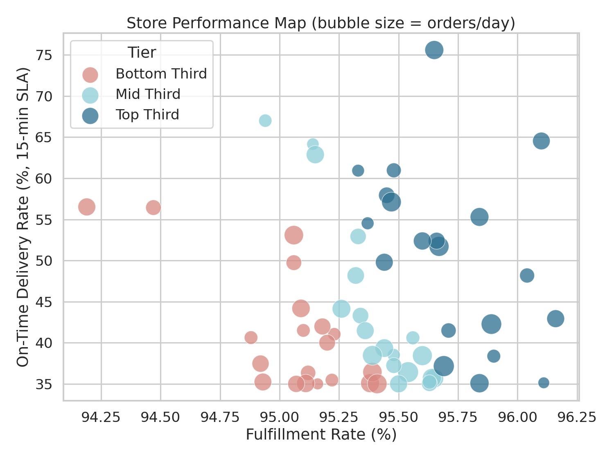
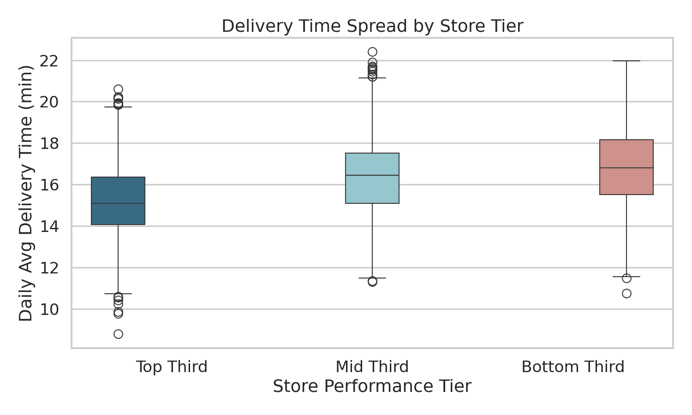
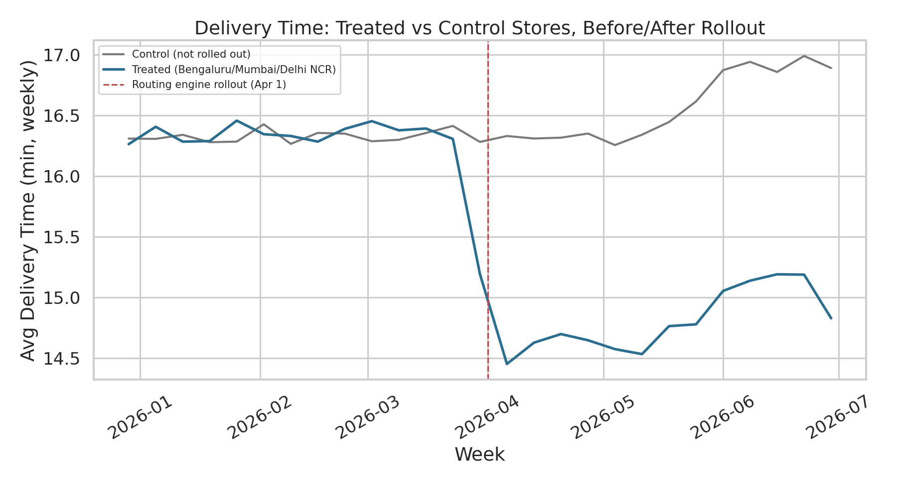

# QuickDash — Dark Store Operations & Causal Analytics

**Project 3 of 5.** This one's different from the first two on purpose —
instead of another funnel-and-retention project, this is an operations
analytics project centered on a natural experiment: did a new
order-routing engine actually reduce delivery times, and can that claim
survive scrutiny given the rollout wasn't randomized?

Stack: **Python (pandas, numpy, seaborn, statsmodels) → SQL (BigQuery) →
Power BI**

> Same note as the other two projects in this series: QuickDash is a
> fictional 10-minute delivery app (modeled on the Zepto/Blinkit/Instamart
> category, not any specific one of them), and the dataset is a documented
> simulation, not real company data. Full parameter list in
> [`docs/assumptions.md`](docs/assumptions.md); business framing and
> hypotheses in [`docs/product_thinking.md`](docs/product_thinking.md).

---

## The Question That Drives This Project

QuickDash promises 15-minute delivery. Internally, that promise isn't being
kept consistently — company-wide, only about 44% of orders hit the 15-minute
mark. Engineering built a new order-batching/routing system and rolled it
out to three cities first (Bengaluru, Mumbai, Delhi NCR) to see if it
helped, before committing to a full company-wide rollout. This project
answers: **did it actually work, and is that number defensible enough to
justify rolling it out everywhere?**

The honest complication: this wasn't an A/B test. The rollout went to
specific cities, not a random sample of stores, so a naive "treated stores
got faster, ship it" conclusion isn't good enough — treated and control
stores could differ for reasons that have nothing to do with the new
system. That's the reason this project leans on diff-in-diff instead of a
simple before/after comparison, and why the write-up below checks the
assumption that makes diff-in-diff valid before trusting the number.

---

## Dataset

| Table | Rows | What it is |
|---|---|---|
| `dark_stores.csv` | 60 | Store master data — city, tier, size, staffing, treatment assignment |
| `store_daily_metrics.csv` | 10,860 | Full-population store × day panel — orders, delivery time, SLA %, GTV |
| `sessions_sample.csv` | 85,000 | Sampled app sessions for funnel analysis (see assumptions doc for why this is a sample and the panel isn't) |

---

## 1. Demand Funnel

`scripts/02_demand_funnel.py` · `sql/funnel.sql`



Session → order conversion lands at **31.3%**, with the steepest drop
between "Reached Browse" and "Added to Cart" (81.3% → 50.6%, a 62.2% step
conversion — the single softest point in the funnel).

The part that's specific to quick commerce rather than generic e-commerce:
of sessions that reach checkout, **9.1% fail because an item in the cart
goes out of stock right at checkout**, against 4.0% for payment/other
failures — stockout is the majority failure mode, not an edge case.



A hypothesis worth checking honestly: Tier 2 city sessions were expected to
convert worse than Tier 1 (thinner catchment density, fewer nearby stores).
They don't — 31.30% vs 31.35%, statistically indistinguishable. Noting this
because a portfolio project that only reports confirmed hypotheses isn't
being fully honest about how analysis actually goes.

---

## 2. Store Performance Tiering

`scripts/03_store_performance_tiering.py` · `sql/store_performance.sql`

Before tiering, a data quality check the script runs automatically: **40 of
10,860 store-days (0.4%) had a negative delivery time**, traced to a
clock-sync issue clustered on a subset of stores in February. Dropped, not
imputed — see `docs/assumptions.md` for why.

Stores are tiered on a composite of fulfillment rate, on-time %, and
stockout-cancel rate (z-scored and averaged, so no single metric dominates
the ranking):

| Tier | Stores | Avg Fulfillment | Avg On-Time % | Avg Stockout Rate | Total GTV |
|---|---:|---:|---:|---:|---:|
| Top Third | 20 | 95.72% | 50.69% | 3.09% | ₹14.46 crore |
| Mid Third | 20 | 95.42% | 43.49% | 3.39% | ₹14.29 crore |
| Bottom Third | 20 | 95.06% | 41.06% | 3.72% | ₹13.22 crore |



The fulfillment-rate gap between tiers looks small in raw percentage terms
(95.72% vs 95.06%, under a point), but it's consistent and it tracks
directly with GTV — the Top Third stores did ₹1.24 crore more in GTV than
the Bottom Third over the same 6-month window, on comparable order volume.
That's not noise; it's a real, addressable operations gap, most likely
staffing or SKU-assortment related rather than something structural about
those specific stores.



---

## 3. The Routing Engine — Diff-in-Diff

`scripts/04_diffindiff_routing_experiment.py` · `sql/diff_in_diff.sql`

**Step 1, before trusting anything: do treated and control stores move
together before the rollout?** If they don't, diff-in-diff isn't valid and
this whole approach falls apart.

```
Pre-period weekly gap (treated - control):
  first week: -0.05 min
  last pre-rollout week: +0.27 min
  standard deviation across the whole pre-period: 0.11 min
```

A gap that stays within ~0.1–0.3 minutes for three months, with no trend,
is about as clean a parallel-pre-trends result as this kind of data gets.
Worth checking — this is often skipped, and skipping it is how DiD claims
end up wrong.



The chart makes the case on its own: the two lines track almost exactly
until April 1, then treated stores drop sharply while control stores keep
drifting with the seasonal (monsoon) pattern through June. That June
uptick in the control line is actually important — it's a common shock
hitting every store, and it's exactly why a simple "treated stores got
faster" claim isn't enough on its own; diff-in-diff nets it out.

**Simple 2×2 table:**

| | Pre-rollout | Post-rollout | Change |
|---|---:|---:|---:|
| Control | 16.33 min | 16.54 min | +0.22 min |
| Treated | 16.36 min | 14.80 min | −1.56 min |

Simple DiD estimate: **−1.78 minutes**.

**Regression DiD** (controlling for city tier and day-of-week, clustered
standard errors by store — because store-days from the same store aren't
independent observations, and treating them as if they were would
understate the uncertainty):

| | Estimate |
|---|---:|
| DiD coefficient (avg delivery time) | **−1.779 min** |
| Clustered SE | 0.042 |
| p-value | < 0.00001 |
| 95% CI | [−1.862, −1.696] min |
| Same model, on-time % as outcome | **+12.70 pp**, p < 0.00001 |

The regression estimate essentially matches the simple 2×2 table (−1.779
vs −1.78), which is itself a useful check — if controls had moved the
number a lot, that would raise a flag about what those controls were
absorbing. They didn't, so the raw comparison was already telling the
right story; the regression mainly tightens the confidence interval.

**Recommendation: roll out company-wide.** The pre-trend check supports a
causal read, the effect is large relative to the ~16-minute baseline (about
a 10% reduction), it shows up in both delivery time and the commercially
relevant SLA metric, and the confidence interval is tight enough to be
useful for planning (a company-wide rollout should expect somewhere between
a 1.7 and 1.9 minute improvement, not a vague "it helps").

---

## Repo Structure

```
QuickDash-Darkstore-Ops-Analytics/
├── README.md
├── requirements.txt
├── data/
│   ├── raw/                              <- generated CSVs
│   └── processed/                        <- script outputs
├── scripts/
│   ├── 01_generate_data.py
│   ├── 02_demand_funnel.py
│   ├── 03_store_performance_tiering.py
│   └── 04_diffindiff_routing_experiment.py
├── sql/
│   ├── schema.sql
│   ├── funnel.sql
│   ├── store_performance.sql
│   └── diff_in_diff.sql
├── visuals/                               <- all charts (.png)
├── powerbi/
│   └── POWERBI_GUIDE.md
└── docs/
    ├── assumptions.md
    └── product_thinking.md
```

## Running It

```bash
pip install -r requirements.txt
python scripts/01_generate_data.py
python scripts/02_demand_funnel.py
python scripts/03_store_performance_tiering.py
python scripts/04_diffindiff_routing_experiment.py
```

### SQL
Written for BigQuery Standard SQL, same `YOUR_GCP_PROJECT_ID` placeholder
pattern as the other two projects — swap it for your actual project ID,
run `schema.sql`, load the CSVs with the `bq load` commands at the bottom
of that file, then run the rest.

### Power BI
See [`powerbi/POWERBI_GUIDE.md`](powerbi/POWERBI_GUIDE.md) for the data
model and every DAX measure needed.
